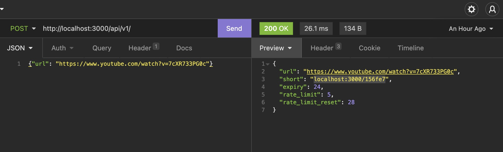

# shorten-url-golang

a url shorten service demo for practising my golang

# usage

1. clone the repo and cd into it
2. `docker-compose up -d`
3. send a request 
4. short url generated and paste it to browser to try
